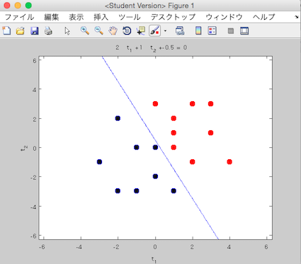

#これはなに

2次元平面上の各点を線形分離する，単純パーセプトロンを MATLAB で実装したものです．

#つかいかた

学習データを記述した CSV ファイルを用意します．
各行を `x座標, y座標, 属するクラス(1 or 0)` として記述してください．
以下は，`sampleData01.csv`の中身です．

```
1,0,0
0,0,0
0,1,0
1,1,1
```

CSVファイル名を引数として，MATLAB上で`simplePerceptron`関数を実行します．
以下は，`sampleData02.csv`を利用した例です．

```MATLAB
simplePerceptron('sampleData02.csv')
```

実行結果は以下のように表示されます．
線形分離できていることがわかります．



線形分離不可能なデータが与えられた場合，エラーが表示されて終了します．

#謝辞

単純パーセプトロンとはなんなのか？という部分からはじまり，作成にあたっては以下のサイトを参考にしました．
ありがとうございました．

>[単純パーセプトロンをPythonで組んでみる](http://tjo.hatenablog.com/entry/2013/05/01/190247)
>[ニューラルネットワーク入門](http://www-ailab.elcom.nitech.ac.jp/lecture/neuro/menu.html)
>[Perceptron - 物理のかぎしっぽ](http://hooktail.org/computer/index.php?Perceptron)
>[ニューラルネットワーク - 静岡理工科大学](https://www.sist.ac.jp/~suganuma/kougi/other_lecture/SE/net/net.htm)
>[ニューラルネットワーク](http://www.sist.ac.jp/~kanakubo/research/neuro.html)
>[第3回 単純パーセプトロン](https://github.com/levelfour/machine-learning-2014/wiki/第3回---単純パーセプトロン)

#License

This project is licensed under the terms of the MIT license. See LICENCE.txt for details.
